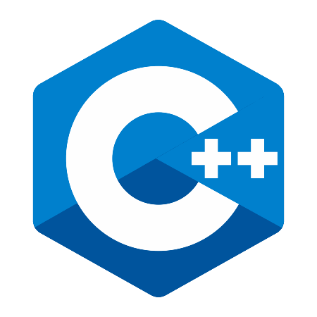
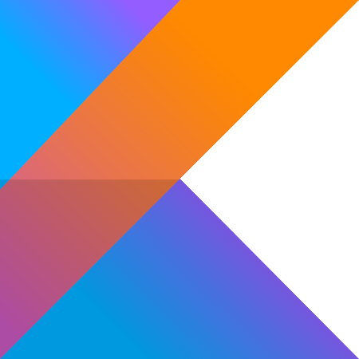

[Kotlin](Kotlin.md) | [C++](C++.md) | [Python](Python.md)


# Podstawy Języków Programowania

Oczywiście, oto rozwinięty tekst:

Witamy na naszej stronie, gdzie możesz dowiedzieć się więcej o podstawach takich języków programowania jak C++, Kotlin, Java i Python. Każdy z tych języków oferuje unikalne możliwości i zastosowania. C++ jest wszechstronnym językiem, idealnym do niskopoziomowej programowania oraz tworzenia efektywnych aplikacji. Kotlin, będący językiem współpracującym z Java na platformie Android, znakomicie sprawdza się w programowaniu aplikacji mobilnych. Java, z kolei, jest jednym z najpopularniejszych języków na świecie, stosowanym w szerokim spektrum aplikacji, od desktopowych po rozwiązania enterprise. Python, z łatwością nauki i czytelną składnią, jest wyborem nr 1 dla analizy danych, sztucznej inteligencji oraz automatyzacji zadań. Zapraszamy do odkrywania różnych aspektów tych języków programowania i rozwijania swoich umiejętności w programowaniu.

## Strona Poświęcona C++

[](C++.html)

## Strona Poświęcona Kotlin

[](Kotlin.html)


#### Header 4

*   This is an unordered list following a header.
*   This is an unordered list following a header.
*   This is an unordered list following a header.

##### Header 5

1.  This is an ordered list following a header.
2.  This is an ordered list following a header.
3.  This is an ordered list following a header.

###### Header 6

| head1        | head two          | three |
|:-------------|:------------------|:------|
| ok           | good swedish fish | nice  |
| out of stock | good and plenty   | nice  |
| ok           | good `oreos`      | hmm   |
| ok           | good `zoute` drop | yumm  |

### There's a horizontal rule below this.

* * *

### Here is an unordered list:

*   Item foo
*   Item bar
*   Item baz
*   Item zip

### And an ordered list:

1.  Item one
1.  Item two
1.  Item three
1.  Item four

### And a nested list:

- level 1 item
  - level 2 item
  - level 2 item
    - level 3 item
    - level 3 item
- level 1 item
  - level 2 item
  - level 2 item
  - level 2 item
- level 1 item
  - level 2 item
  - level 2 item
- level 1 item

### Small image


### Large image


### Definition lists can be used with HTML syntax.

<dl>
<dt>Name</dt>
<dd>Godzilla</dd>
<dt>Born</dt>
<dd>1952</dd>
<dt>Birthplace</dt>
<dd>Japan</dd>
<dt>Color</dt>
<dd>Green</dd>
</dl>

```
Long, single-line code blocks should not wrap. They should horizontally scroll if they are too long. This line should be long enough to demonstrate this.
```

```
The final element.
```
