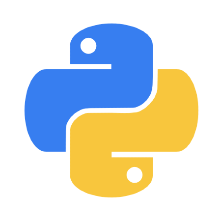

[Kotlin](Kotlin.md) | [C++](C++.md) | [Python](Python.md)

# Podstawy Języków Programowania

Oczywiście, oto rozwinięty tekst:

Witamy na naszej stronie, gdzie możesz dowiedzieć się więcej o podstawach takich języków programowania jak C++, Kotlin, Java i Python. Każdy z tych języków oferuje unikalne możliwości i zastosowania. C++ jest wszechstronnym językiem, idealnym do niskopoziomowej programowania oraz tworzenia efektywnych aplikacji. Kotlin, będący językiem współpracującym z Java na platformie Android, znakomicie sprawdza się w programowaniu aplikacji mobilnych. Java, z kolei, jest jednym z najpopularniejszych języków na świecie, stosowanym w szerokim spektrum aplikacji, od desktopowych po rozwiązania enterprise. Python, z łatwością nauki i czytelną składnią, jest wyborem nr 1 dla analizy danych, sztucznej inteligencji oraz automatyzacji zadań. Zapraszamy do odkrywania różnych aspektów tych języków programowania i rozwijania swoich umiejętności w programowaniu.

## Strona Poświęcona C++

## Strona Poświęcona Kotlin

## Strona Poświęcona Python

Strony Partnerskie

[Facebook](https://m.facebook.com/zstkolbuszowa) | [Strona](https://bartdurak.github.io/1a/) | [Blogspot](http://pbud.blogspot.com) | [YouTube](https://www.youtube.com/@bartomiejdurak1723)

